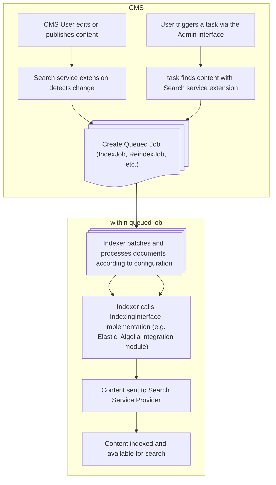

# Overview and rationale

This module provides a set of abstraction layers that integrate the Silverstripe CMS content 
with a search-as-a-service provider, such as [Elastic](https://elastic.co) or [Algolia](https://algolia.com). The focus
of this module is on getting content into your service (indexing) only and does not provide any frontend tooling for UI nor [APIs for querying data](https://github.com/silverstripeltd/silverstripe-discoverer).

## Indexing workflow

The CMS interacts with this module via Silverstripe Extensions on the content you want indexed. When this content changes (e.g. is published) a [Queued Job](https://github.com/symbiote/silverstripe-queuedjobs) will be created to handle the indexing:

## Next
* [Configuring the module](02_configuration.md)
