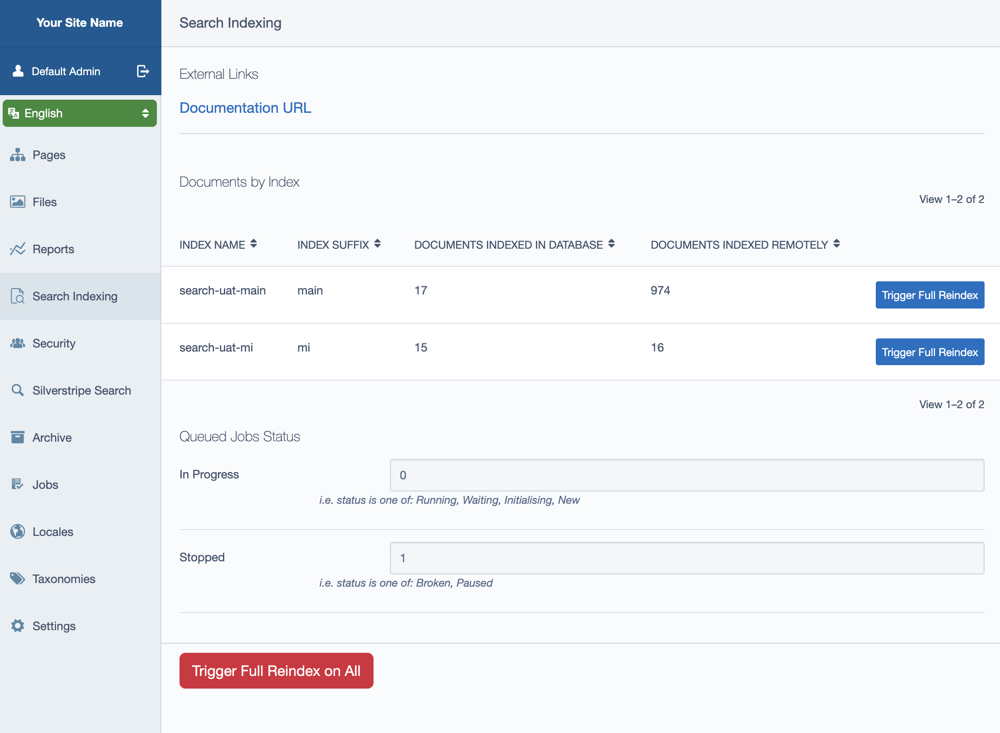

# Usage

For most cases, DataObject based content should index with configuration only,
but there are some important concepts to understand about what is happening internally
and how to manage your index with so much activity happening implicitly through content
changes.

## CMS Admin

For admin users and other users with the `CMS_ACCESS_SearchAdmin` permission, there will be a
Left and Main "dashboard" labelled "Search Indexing" available. This contains data about objects
that are indexed, links to documentation and other resources, and the ability to trigger a
reindex (with `ADMIN` permissions).



See `IndexingInterface` for how these external links are configured for your implementation.

## Pages and other DataObjects

Publish and unpublish events will instantiate an `IndexJob`, described below. If the
`use_sync_jobs` setting is on, it will be viewable in the index upon completion of the
network request. This setting is not recommended for production, however, and therefore
you may have a slight delay between saving the content and seeing it in the index depending
on how your jobs are set up (more information below).

## Jobs

All jobs are configured to be run immediately. (`QueuedJob::IMMEDIATE`). For more information
on setting up immediate execution of jobs, see the [QueuedJobs documentation](https://github.com/symbiote/silverstripe-queuedjobs#using-queuedjobimmediate-jobs).

There are several jobs that come with this module:

* `IndexJob`: This job is responsible for indexing one or many documents and removing documents
if they are determined to be invisible to the index (e.g. a false `shouldIndex()` check). It will
also reindex dependent documents if you have the `auto_dependency_tracking` enabled. (See [Dependency tracking](#dependency-tracking))

* `ClearIndexJob`: Clear an entire index. May run for a long time, as this job does not use any
concurrency.

* `ReindexJob`: Reindex all documents. Does not do any dependency tracking since it's all inclusive.

* `RemoveDataObjectJob`: A special job for DataObjects that cleans up its dependencies after it is unpublished.


## Tasks

Most of these jobs can be run manually using sake tasks:

- `sake tasks:SearchReindex`: Reindex all documents
- `sake tasks:SearchClearIndex`: Clear all documents from a given index. Requires an `--index` option
- `sake tasks:SearchConfigure`: Configure the search service (see below)

## Configuring the search service

Most search services such as EnterpriseSearch require some level of configuration that needs
to happen separately from the indexing of content. This can include operations like 
creating indexes, and defining a schema for an index.
 
Indexing services are required to define a `configure()` method, and this method is invoked
during the `db:build` process, as well as in the `tasks:SearchConfigure` task, for a more direct
approach.

## Extension points
There are multiple extension points in this module but some are only relevant to provider implementation or deeper [customisations](./05_customising.md). The following are the more commonly used extension points provided by the module's DataObject implementation

### DataObject extension points

#### canIndexInSearch(): bool

A DataObject or extension implementing this method can add supplementary logic to the [shouldIndex()](../../src/DataObject/DataObjectDocument.php#L128) method for determining whether a record should be indexed. More control can be had via the [IndexableHandler interface](./08_customising_more.md#indexablehandler-interface)

#### updateSearchDependentDocuments(&$dependentDocs): void

A DataObject extension implementing this method can add dependent documents to its dependency list. This is particularly relevant if you're not using `auto_dependency_tracking`. It is important to remember that `$dependentDocs` in this context should be first-class `DocumentInterface` instances, not DataObjects. For example:

```php
public function updateSearchDependentDocuments($dependentDocs): void
{
    $extraDependency = DataObject::get_by_id($this->dependencyID);
    $doc = DataObjectDocument::create($doc);
    $dependentDocs[] = $doc;
}
```

### DataObjectDocument extension points

#### updateSearchAttributes(&$attributes)

You can use this method to arbitrarily update all DataObject documents before they are handed off to the indexer. This method is called after the `DocumentBuilder` has applied its own metadata.

You can also add this method on any DataObject. In this case it is used to update the document for just that class.

### Job extension points

Indexing jobs have the following extension points:

- onBeforeSetup
- onAfterSetup
- onBeforeProcess
- onAfterProcess

## Index Contexts
Index contexts allow you to control the operational context in which indexing occurs for each index. This is useful for scenarios such as ensuring that only published (Live) content is indexed, or for supporting multi-language (Fluent) setups.

### How Index Contexts Work

- Each index can specify a `context` key in its [configuration](./02_configuration.md#index-contexts). If not specified, the default context (`default`) is used.
- Contexts are managed by the `IndexData` class, which wraps indexing operations in the appropriate context using registered `IndexDataContextProvider` classes.
- A context is a callable that sets up the environment (e.g., reading mode, locale) for the duration of the indexing operation.

### Creating Custom Contexts

To add a custom context, implement the [IndexDataContextProvider](../../src/Interfaces/IndexDataContextProvider.php) interface and register your provider. Each provider returns a callable that wraps the indexing operation.

For example, the module provides a `LiveIndexDataContext` that ensures indexing happens in Live mode:

```php
class LiveIndexDataContext implements IndexDataContextProvider
{
    public function getContext(): callable
    {
        return function (callable $next): mixed {
            return Versioned::withVersionedMode(function () use ($next): mixed {
                Versioned::set_stage(Versioned::LIVE);
                return $next();
            });
        };
    }
}
```

You can register additional providers to support other contexts, such as Fluent locales or custom business logic. Registration is done in yaml:

```yaml
SilverStripe\Forager\Service\IndexData:
    properties:
      contexts:
        custom:
          MyCustomContext: '%$App\MyCustomContext'
```

You can then apply the custom context to an index suffix in the the [configuration](./02_configuration.md#index-contexts).

## Dependency tracking

When dealing with relational data in search documents, managing these interdependencies
can range from a minor inconsistency to a serious concern. Imagine the following scenario:

```yaml
SilverStripe\Forager\Service\IndexConfiguration:
  indexes:
    myindex:
      includeClasses:
        MyProject\MyApp\BlogEntry:
          fields:
            title: true
            content: true
            tags:
              property: 'Tags.Title'
```

The search index to store all the titles of the `Tags` relationship. But what happens
when I delete or unpublish a tag? Without dependency tracking, I now have a blog
with a stale set of tags in the search index.

It can be worse, too: 

```yaml
SilverStripe\Forager\Service\IndexConfiguration:
  indexes:
    myindex:
      includeClasses:
        MyVendor\MyStore\Models\Product:
          fields:
            title: true
            description: true
            price: true
        MyVendor\MyStore\Pages\HomePage:
          fields:
            featured_product_titles:
              property: 'FeaturedProducts.Title'
            featured_product_price:
              property: 'FeaturedProducts.Price'
```

Let's say I'm having a sale and I take 50% of the price of a featured product. If I'm
 not dealing with dependency tracking properly, the home page will still show the full 
 price in search. This is not good for business!

To negotiate this problem, documents may implement the `DependencyTracker` interface
(more information in [Customising and extending](05_customising.md)). Documents that
use this interface must declare a `getDependentDocuments()` method that tells the
indexer explicitly what other content must be updated when it changes.

For DataObjects, the safest option here is to define a `updateSearchDependentDocuments` method
and return an array of `DataObjectDocument` instances. Otherwise, you can turn on
`auto_dependency_tracking` in the `IndexConfiguration` class and allow the document
to compute its own dependencies through ORM introspection and querying.

## More information

* [Configuration](02_configuration.md)
* [Implementations](04_implementations.md)
* [Customising and extending](05_customising.md) 
* [Overview and Rationale](01_overview.md)
