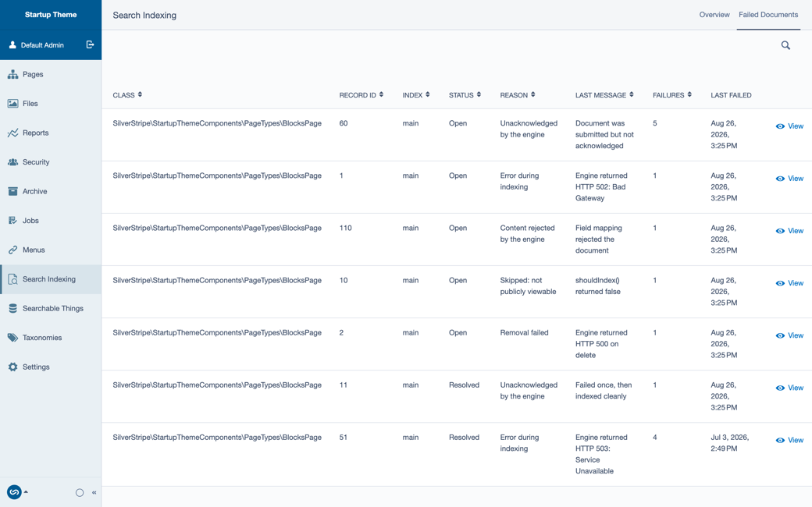
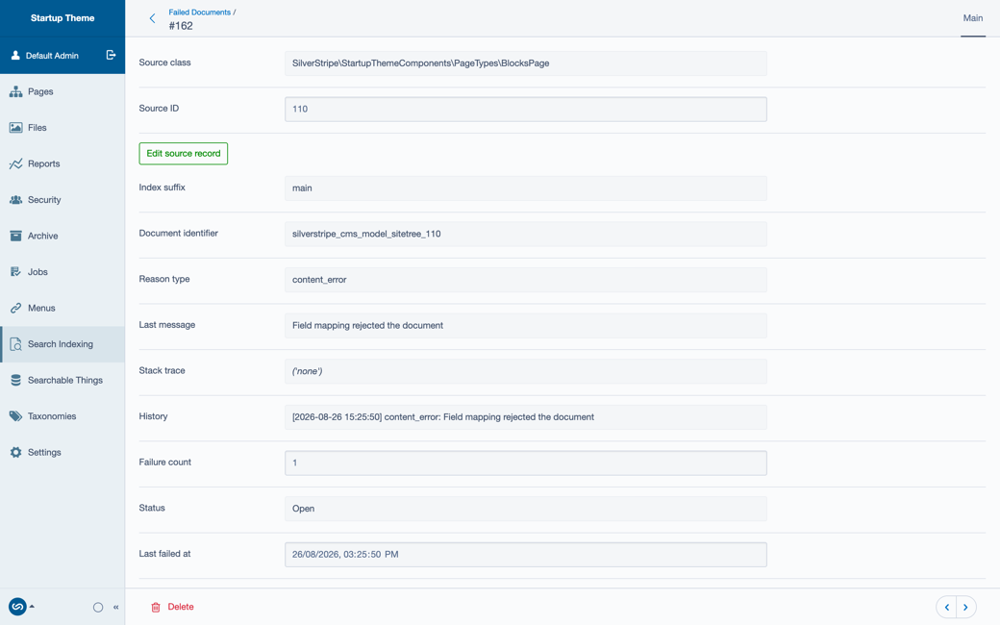
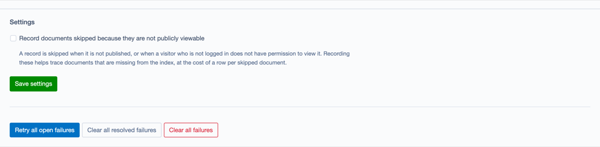

# Indexing failures

When a record fails to reach a search index, it is missing from search results. Forager records each
failure against the record it came from, so the people who look after a site can see which content is
affected and why, and send it to the index again once the cause is fixed.

Failures are listed in the CMS under **Search Indexing**, on the **Failed Documents** tab. This is
available from version 2.1.0. Run a `dev/build` after upgrading, which adds the table the failures are
stored in.

Forager provides the failure model, the admin and the retry jobs. Detecting a failure is the job of the
service integration module, because only it knows how its search service reports an error. For
example, `silverstripe/silverstripe-forager-bifrost` records failures from version 2.2.0. An
integration records failures through `IndexingFailureService`. See
[Adding a new search service](06_customising_add_search_service.md) for how an integration is built.

## Failed documents



Each row is one record that could not be indexed, and shows:

- **Class** and **Record ID**: the record the document was made from.
- **Index**: the index the document was being sent to.
- **Status**: **Open** while the record is still failing, or **Resolved** once a later attempt succeeds.
- **Reason**: why the document failed. See [Failure reasons](#failure-reasons).
- **Last message**: the most recent error the search service or the CMS reported.
- **Failures**: how many times indexing this record has failed.
- **Last failed**: when the most recent failure happened.

A record has one row per index. If it fails again, the same row is updated and the failure count goes
up, rather than a new row being added. When the record is indexed successfully, its row is marked
**Resolved** without anyone needing to do anything.

Use the search icon above the list to filter by class, record ID, index, reason, message, failure count
or status.

### Failure reasons

| Reason | What it means |
| --- | --- |
| Error during indexing | The request to the search service failed, for example because the service returned an error or could not be reached. These failures are often temporary, and a retry usually succeeds once the service is available again. |
| Content rejected by the engine | The search service received the document but refused it, for example because a field's value does not match the type the engine expects for that field. The message shows the reason the service gave. Fix the content or the field configuration before retrying. |
| Unacknowledged by the engine | The document was sent, but the search service did not confirm that it was indexed. |
| Removal failed | The document could not be removed from the index, for example after its record was unpublished or deleted. A retry tries the removal again rather than indexing the document. |
| Skipped: not publicly viewable | The record was not sent because it is not published, or because a visitor who is not logged in cannot view it. These rows are only recorded when the setting described in [Settings](#settings) is turned on. |

## Viewing a failure

Select **View** on a row to see the full details of a failure.



The details show the document identifier, the full last message and a history of each failure for that
record, with the date and time it happened. **Edit source record** opens the record in the CMS, so the
content that caused the failure can be corrected.

Where the service integration captures one, the details also include a stack trace. Stack traces can
show file paths and the internal structure of a site, so they are only shown to people with the
`SearchAdmin_ViewStackTrace` permission.

## Retrying and clearing failures

Once the cause of a failure is fixed, the record can be sent to the index again:

- **Retry** on a single row queues that record to be indexed again. For a failed removal, the retry
  tries the removal again.
- **Retry all open failures** retries every open failure. If an index job was interrupted, it is resumed
  where it stopped. The remaining failures are queued as one job for each index.

Retries run as queued jobs, so a row changes to **Resolved** once its job has run and the record has
been indexed.

Rows can also be removed from the list:

- **Clear** on a single row removes that failure from the list.
- **Clear all resolved failures** removes every resolved row and keeps the open ones.
- **Clear all failures** removes every row, open and resolved.

Clearing a failure only removes the row from the list. It does not change the record or the index.

Resolved failures are removed 30 days after they were resolved by `PruneIndexingFailuresJob`, which the
module registers as a queued jobs default job that runs each night at 02:00.

## Settings



**Record documents skipped because they are not publicly viewable** adds a row for each record that is
not sent to the index because it is not published, or because a visitor who is not logged in cannot
view it. Turn this on when tracing content that is missing from search results, to rule out visibility
as the cause. Each skipped record adds a row, so turn it off again once it has served its purpose.

Select **Save settings** to apply the change.

## Permissions

| Permission code | Name in the CMS | Allows |
| --- | --- | --- |
| `CMS_ACCESS_SearchAdmin` | Allow viewing of search configuration and status, and links to external resources | Access to the Search Indexing admin, including the Failed Documents tab |
| `SearchAdmin_RetryFailedDocument` | Retry and clear failed indexing documents | The Retry and Clear actions |
| `SearchAdmin_ViewStackTrace` | View indexing failure stack traces | Seeing the stack trace on a failure's details. Grant this only to people who investigate errors. |
| `SearchAdmin_ReIndex` | Trigger Full ReIndex | Reindexing an entire index from the Overview tab |

## Configuration

Two settings control how failures are kept:

```yaml
SilverStripe\Forager\Service\IndexConfiguration:
  # Days a resolved failure is kept before the nightly job removes it. 0 keeps them.
  resolved_failure_retention_days: 30
  # Failures a single index job may record before it stops. 0 removes the limit.
  max_failures_per_job: 100
```

The failure limit stops an index job that records more than 100 failures, rather than letting it record
a row for every document in a large index while the search service is unavailable. The job throws
`IndexingFailureCapException`, its remaining documents are kept, and it can be resumed with
**Retry all open failures** once the service is available again.
